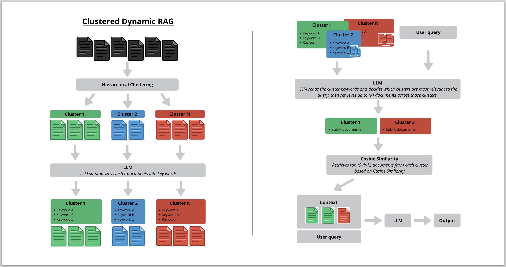
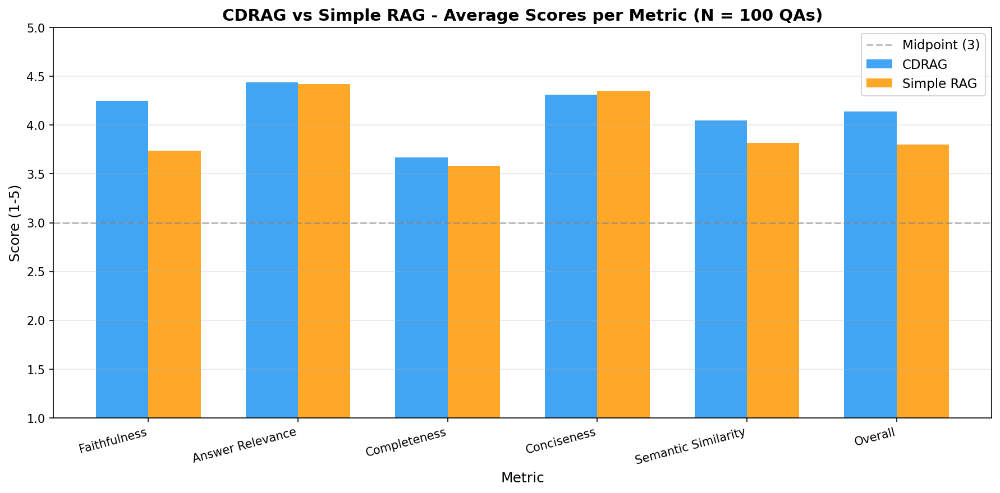
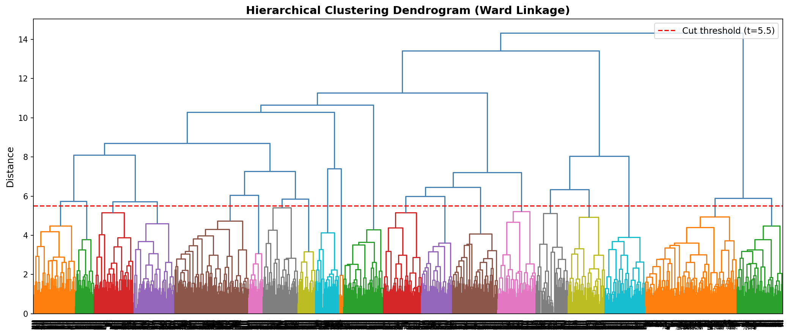

# Clustered (Dynamic) Retrieval-Augmented Generation

I developed an addition on a CRAG framework that uses LLM-guided cluster-aware retrieval for legal question answering, benchmarked against a standard top-K retrieval on the [`isaacus/legal-rag-bench`](https://huggingface.co/datasets/isaacus/legal-rag-bench) dataset.

---

## Overview

Standard RAG systems retrieve the top-K most similar documents from an entire corpus using cosine similarity. While simple and effective, this approach is **corpus-blind**, it has no awareness of the semantic structure of the document collection.

This can be especially problematic for complex questions that must be interpreted or approached from multiple abstraction levels, such as legal ones. Cosine similarity retrieves documents that are lexically and semantically close to the query, but may under-retrieve documents that are relevant at a higher level of abstraction. 

For example, a question about *whether a defendant's silence can be used as evidence* might retrieve passages about silence in interrogation, while missing higher-level doctrine on the burden of proof or the presumption of innocence — context that is essential for a complete legal answer but uses none of the same vocabulary.

More advanced retrieval architectures exist, such as hierarchical indexing, graph-based retrieval, and hybrid dense-sparse method, each replacing or augmenting flat cosine similarity with more structured retrieval strategies. 

**CDRAG (Clustered Dynamic Retrieval-Augmented Generation)** addresses this same problem by:
1. Pre-clustering the corpus into semantically coherent groups
2. Extracting LLM-generated keywords per cluster to summarise their content
3. At query time, asking an LLM to *reason* about which clusters are relevant and how many documents to draw from each. This way the LLM can explore multiple abstraction levels or periphally related topics
4. Performing cosine similarity retrieval *within* the selected clusters only 

This allows the retrieval budget (top-K) to be allocated dynamically and intelligently across the document space rather than spread blindly across the full corpus.

<p align="center">
  
  <br>
  <em>CDRAG architecture embedding (left), retrieval (right)</em>
</p>

## Results

CDRAG was evaluated against Simple RAG across 100 legal questions from the Legal RAG Bench dataset, scored by an LLM judge on 6 metrics (1–5 scale).

CDRAG outperforms standard (top-k) RAG on 5 out of 6 metrics. The largest gains are in **faithfulness** (+0.51) and **overall quality** (+0.34), suggesting that routing queries to semantically relevant clusters produces more accurate and grounded answers. The only metric where standard RAG performs marginally better is **conciseness** (4.35 vs 4.31).

<p align="center">
  
  <br>
  <em>Average scores across 6 metrics over 100 legal questions</em>
</p>

---

## Repository Structure

```
.
├── config.yaml                  # Model, clustering, and retrieval settings
├── pipelines/
│   ├── build_index.py           # One-time index construction pipeline
│   └── evaluate.py              # Head-to-head evaluation: CDRAG vs Simple RAG
├── src/
│   ├── index.py                 # Embedding, clustering, keyword extraction
│   ├── retrieval.py             # CDRAG and simple retrieval implementations
│   ├── generation.py            # Answer generation and LLM judge
│   └── utils.py                 # Shared utilities
└── results/
    ├── mapping.pkl              # Document → cluster mapping with embeddings
    ├── cluster_keywords.json    # LLM-extracted keywords per cluster
    └── results.csv              # Per-question evaluation scores
```

---

## Method

### 1. Index Construction (`src/index.py`, `pipelines/build_index.py`)

Run once before evaluation.

```bash
python -m pipelines.build_index
```

**Steps:**

| Step | Description |
|------|-------------|
| **Embed** | All corpus documents are encoded with a `SentenceTransformer` model |
| **Cluster** | Hierarchical agglomerative clustering (Ward linkage) partitions documents using a distance threshold from `config.yaml` |
| **Keyword extraction** | For each cluster, document texts are chunked and passed to an LLM to extract representative keywords, avoiding duplicates across chunks |

The resulting `mapping.pkl` (document–cluster–embedding table) and `cluster_keywords.json` are saved to `results/` and reused at evaluation time.

**Example cluster keywords (`cluster_9`):**
```
beyond reasonable doubt · onus on the prosecution
Jury Directions Act 2015 · circumstantial evidence
reasonable hypothesis consistent with innocence
```

To create the clusters I cut the dendrogram at distance 5.5, there are other plausible (higher) values too, but that would mean that nuanced information is still lost, as more candidate documents are put on one heap for the top-k search within clusters. 

<p align="center">
  
</p>
---

### 2. Retrieval (`src/retrieval.py`)

#### standard RAG (Baseline)
Computes cosine similarity between the query embedding and **all** document embeddings, returning the top-K documents regardless of cluster.

```python
simple_retrieval(query_embedding, all_embeddings, all_ids, mapping, k)
```

#### CDRAG
A two-stage retrieval process:

**Stage 1 — Cluster selection (LLM-guided)**

The query and all cluster keyword summaries are passed to an LLM. The LLM returns a structured JSON plan specifying:
- Which clusters to retrieve from
- How many documents (`sub_k`) to retrieve from each cluster group

The total across all groups is constrained to equal K.

```json
{
  "retrievals": [
    {"sub_k": 3, "clusters": ["cluster_9", "cluster_18"]},
    {"sub_k": 2, "clusters": ["cluster_3"]}
  ]
}
```

**Stage 2 — Within-cluster cosine retrieval**

For each cluster group in the plan, cosine similarity is computed only over documents in those clusters. The top `sub_k` documents are selected, with deduplication across groups.

```python
clustered_dynamic_retrieval(question, query_embedding, mapping,
                             cluster_keywords, cluster_size, k, config, client)
```

---

### 3. Evaluation (`pipelines/evaluate.py`)

```bash
python -m pipelines.evaluate
```

For each question in the `qa` test split, both systems generate an answer using the same LLM and prompt. An **LLM-as-judge** then scores both answers against the ground truth across six metrics (1–5 scale):

| Metric | Description |
|--------|-------------|
| `faithfulness` | Factual consistency with ground truth |
| `answer_relevance` | Whether the answer addresses the question |
| `completeness` | Coverage of key aspects from ground truth |
| `conciseness` | Absence of irrelevant content |
| `semantic_similarity` | Semantic closeness to ground truth |
| `overall` | Holistic quality score |

Running averages are printed after each question, and final results are saved to `results/results.csv`.

---

## Dataset

Both systems are evaluated on [`isaacus/legal-rag-bench`](https://huggingface.co/datasets/isaacus/legal-rag-bench), a benchmark for legal retrieval-augmented generation. The corpus covers Australian criminal law topics including:

- Jury directions (Jury Directions Act 2015)
- Evidence law (Evidence Act 2008)
- Criminal offences and defences (Crimes Act 1958)
- Procedure, mental impairment, and sentencing

---

## Setup

### Requirements

Install dependencies:
```bash
pip install -r requirements.txt
```

### Environment

Create a `.env` file:
```
OPENAI_API_KEY=your_key_here
```

### Configuration (`config.yaml`)

Key settings:
```yaml
embedding_model: "..."         # SentenceTransformer model name
llm_model: "..."               # OpenAI model for generation and retrieval planning
judge_model: "..."             # OpenAI model for evaluation
retrieval:
  k: 40                        # Total documents to retrieve per query
clustering:
  method: "hierarchical"    # Agglomerative clustering using Ward linkage
  threshold: 5.5            # You can set this by inspecting the dendrogram (lower = more clusters)
  criterion: "distance"     # Clusters are formed by cutting the tree at the given distance threshold     
evaluation:
  metrics:
    - faithfulness
    - answer_relevance
    - completeness
    - conciseness
    - semantic_similarity
    - overall
```

---

## Running the Full Pipeline

```bash
# Step 1: Build the index (once)
python -m pipelines.build_index

# Step 2: Run evaluation
python -m pipelines.evaluate
```

Results are written to `results/results.csv`.

---

## Similar work

Akesson, S., & Santos, F. A. (2024) propose CRAG (Clustered Retrieval-Augmented Generation). While related in spirit, it differs from the architecture used in this project. In CRAG, clustering is applied after the retrieval step, grouping the retrieved documents by semantic similarity. An LLM then summarises each cluster, and a final aggregate summary is used as the context for generation.

> Akesson, S., & Santos, F. A. (2024). *Clustered Retrieval-Augmented Generation (CRAG)*. arXiv:2406.00029. Retrieved from https://arxiv.org/abs/2406.00029

A related approach is described in this blogpost, where the corpus is first clustered and an LLM generates a summary for each cluster. These summaries are then embedded, and cosine similarity is used to match the query to the most relevant cluster, from which documents are sampled again using Top-K.

> https://dev.to/praveensk/-building-scalable-rag-systems-with-hierarchical-clustering-hierarchical-rag-and-why-cluster-398o